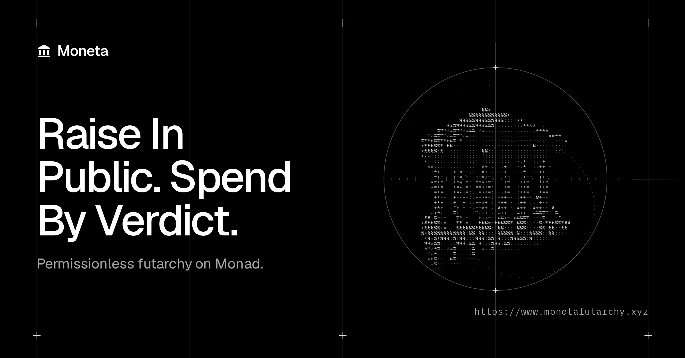

# Moneta

### Where unicorns raise their first round.

Moneta is the initial funding platform for crypto startups on Monad. Founders raise in public, backers fund the plan, and the market decides how every dollar gets spent. All powered by futarchy.

**[Launch the app](https://www.monetafutarchy.xyz)** · [Read the docs](https://www.monetafutarchy.xyz/docs) · [Run it locally](#run-it-locally)

---

## The Problem

A crypto founder raising a first round has two options today, and both are broken.

- **Venture capital** is slow, private and gated by who you know. The community only gets in at launch, often as exit liquidity.
- **Token launchpads** are fast but built for hype. Once the money lands, nothing holds the founder to the plan, and backers can only sell.

Neither one ties the money to the work.

## The Fix

Moneta lets anyone raise in public, then puts the treasury under the control of the market instead of the founder.

The founder gets a steady budget to build with. Every other dollar is released only when the market agrees it makes the project more valuable. That is futarchy: instead of voting on what to do, people bet on what will work, and the bet decides.

## How It Works

1. **Raise.** A founder posts a plan, a token price and a funding goal. Anyone can back it with USDC, and everyone pays the same price. Miss the goal and every backer is refunded in full.
2. **Launch.** A successful raise launches the token, a market to trade it in, and a treasury, all in one transaction. No one holds the treasury's keys, not even the founder.
3. **Build.** The founder draws an operating budget that streams in by the second. Anything beyond that, like releasing the next milestone's funds, needs a proposal. Anyone can write one.
4. **Decide.** Each proposal opens two markets. One prices the token if the proposal passes, the other if it fails. If the pass price comes out ahead, the money moves automatically. If not, it stays put.

### A quick example

Lumen raises 1,000,000 USDC. Months later the team ships its mainnet and asks for the next 250,000 USDC.

Traders price Lumen at $0.118 a token if the funds are released and $0.104 if they are not. Releasing them is worth more, so the proposal passes and the USDC goes straight to the team. No vote, no multisig, no one signing off.

Then the team asks for 400,000 USDC to pay for a celebrity endorsement. Traders price that world lower, the proposal fails, and the money never leaves the treasury.

## Why It Works for Everyone

**Founders** raise without a gatekeeper, get a predictable budget from day one, and build alongside a community that is invested in their success. An optional performance package mints extra tokens to the team only when the token holds at 2x, 4x or 8x the raise price.

**Backers** pay the same price as everyone else and can trade from launch. Beyond the founder's budget, their money is only spent when the market approves. If a team stalls, anyone can propose winding the project down. If the market agrees, every holder redeems their exact share of what is left in the treasury.

**Traders** earn by being right about which decisions make a project more valuable. Their bets are the signal that steers the capital.

## Built to Be Trusted

- **No one can touch the funds.** The contracts cannot be upgraded. Moneta's admin can only adjust settings for future raises, within hard limits. It cannot move money, change a live project's rules, or pause trading.
- **Exits always work.** Refunds, claims and redemptions cannot be blocked by anyone.
- **Hard to game.** Verdicts use the average price across a multi-day trading window, and the tracked price can only move a small step each second. A last-minute pump barely registers, and anyone who pushes the price off course hands a profit to the traders who push it back.
- **Proposals carry a deposit.** Proposers post USDC that comes back if the proposal passes and goes to the treasury if it fails.
- **Every project stands alone.** Each raise and treasury is its own contract, so trouble in one cannot reach another.

## Why Monad

Every proposal runs two markets that trade for days and record a price every second. That only works on a chain that is fast and cheap. Monad's 300 ms blocks and sub-second finality make fully onchain decision markets practical, and full EVM compatibility means a passed proposal can call any contract on Monad.

## Try It

Moneta is live on Monad testnet at **[monetafutarchy.xyz](https://www.monetafutarchy.xyz)**.

1. Add Monad Testnet to your wallet: chain ID `10143`, RPC `https://testnet-rpc.monad.xyz`.
2. Get test MON from [faucet.monad.xyz](https://faucet.monad.xyz) and test USDC from [faucet.circle.com](https://faucet.circle.com).
3. Back a raise, trade a proposal, or launch your own.

## Run It Locally

You need Node 24, pnpm 10, [Foundry](https://getfoundry.sh) and Docker.

```bash
pnpm install
cp .env.example .env
pnpm dev
```

Open <http://localhost:3000>. No secrets are needed. The app talks to the contracts already deployed on Monad testnet, and the first run takes a few minutes while it builds the indexer.

Other useful commands:

- `pnpm test` runs every test suite: contracts, SDK, indexer, bots and web.
- `pnpm dev:local` starts a private local chain with demo projects and trading bots. It has no UI and is meant for testing.
- `bash scripts/e2e.sh` runs the full user journey in a real browser.
- `pnpm typecheck` and `pnpm lint` run the static checks.

To deploy your own contracts to testnet, follow the [testnet deploy runbook](docs/runbooks/testnet-deploy.md).

## What's Inside

```text
apps/web             The app (Next.js): explore, launch a raise, trade proposals, track your portfolio
apps/indexer         Turns onchain events into a fast, searchable API (Envio HyperIndex)
apps/bots            Settles finished proposals, keeps markets trading, watches for problems
packages/contracts   The smart contracts (Solidity, Foundry)
packages/sdk         Shared TypeScript toolkit that connects the contracts to everything else
```

Design decisions are recorded in [docs/adr](docs/adr), and the security review lives in [docs/security](docs/security/static-analysis.md).

## Roadmap

- **Now:** permissionless raises, milestone funding and redemption.
- **Next:** existing Monad projects adopt Moneta treasuries.
- **Then:** the Moneta Fund, where markets decide which projects get funded at all.
- **Later:** revenue share, convertibles and secondary markets.

## The Name

Rome minted its coins at the temple of Juno Moneta, and the words _money_ and _mint_ both come from her name. That name is traced to the Latin _monere_, to warn or advise. Moneta is a mint that takes advice: capital moves only when the market says it should.
